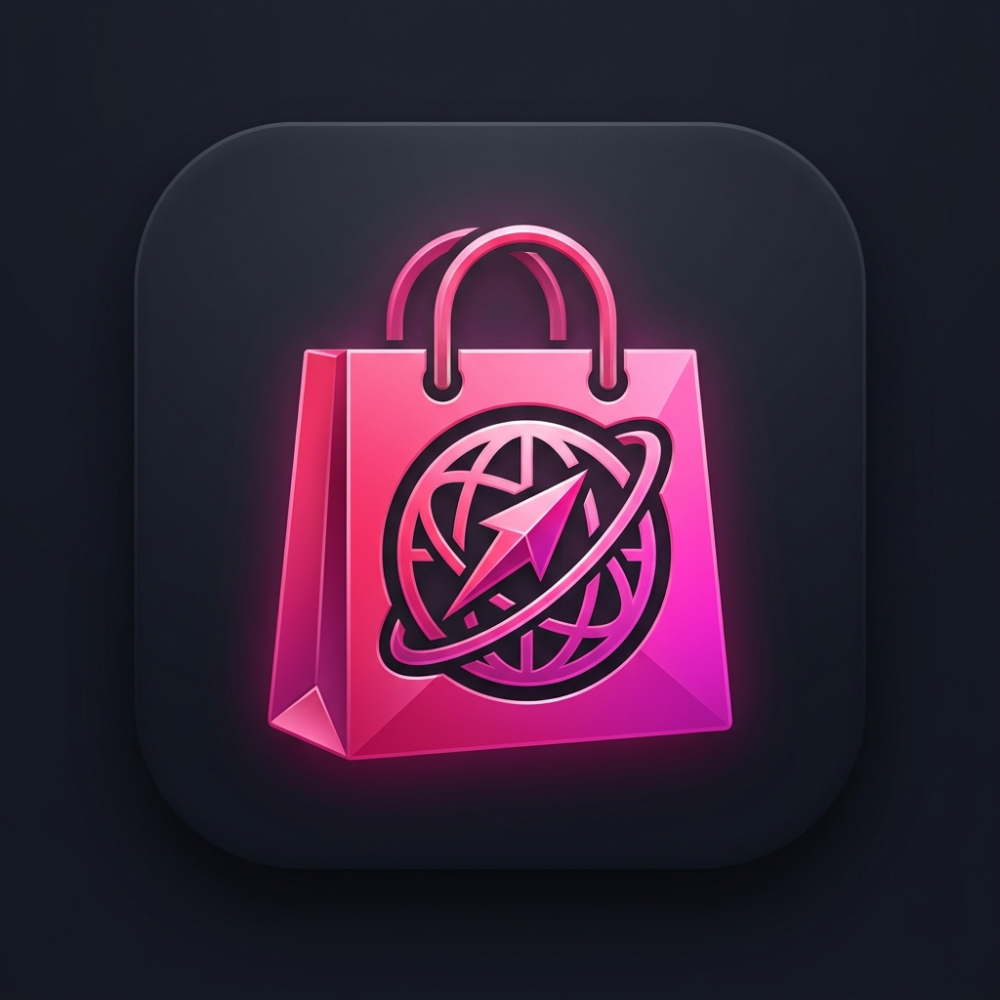

# SHEIN Browser — متصفح شي إن

<p align="center">
  
</p>

متصفح ويب مخصص لموقع **SHEIN** مبني بـ **Flutter**، مصمم للأجهزة المحمولة (Android) وسطح المكتب (Windows). يوفر تجربة تصفح سلسة مع استخراج بيانات المنتجات تلقائياً، دعم التبويبات المتعددة، تجاوز أنظمة مكافحة البوت، وتحسينات الأداء للأجهزة الضعيفة.

---

## ✨ الميزات الرئيسية

### 🌐 تصفح متقدم
- **تبويبات متعددة** — فتح وإغلاق وتبديل بين التبويبات مع حفظ واستعادة الجلسة
- **وضع التصفح الخفي (Incognito)** — تصفح بدون حفظ الكوكيز أو السجل
- **تبديل Mobile/Desktop** — تبديل User-Agent بين وضع الموبايل وسطح المكتب
- **شريط عنوان ذكي** — عرض وتحرير URL الحالي مع دعم البحث
- **سجل التصفح والمفضلة** — حفظ وإدارة المواقع المفضلة وسجل الزيارات

### 🛍️ استخراج بيانات المنتجات
- **كشف تلقائي للمنتجات** — عند فتح صفحة منتج من SHEIN، يتم استخراج:
  - الاسم، السعر، السعر الأصلي، العملة
  - رقم SKU، الصور، الوصف
  - التقييم وعدد المراجعات
- **معاينات مصغرة (Product Previews)** — فتح روابط المنتجات في الخلفية (HeadlessInAppWebView) والتقاط لقطات شاشة
- **تحميل المنتجات في الخلفية** — معالجة دفعات من روابط المنتجات (حتى 30 رابط) مع عداد التقدم
- **شريط جانبي للمنتجات** — عرض المنتجات المكتشفة في لوحة جانبية مع تفاصيل كاملة

### 🛡️ تجاوز مكافحة البوت (Anti-Bot Bypass)
- **User-Agent واقعي** — تبديل عشوائي بين Samsung/Pixel للهواتف و Chrome للديسكتوب
- **حقن JavaScript** — تعديل خصائص Navigator لإخفاء هوية WebView
- **محاكاة بشرية** — حركات ماوس عشوائية وأنماط تمرير واقعية
- **تأخيرات زمنية طبيعية** — تجنب الطلبات المتتالية السريعة

### ⚡ تحسين الأداء
- **كشف قدرات الجهاز** — تصنيف الأجهزة إلى 3 فئات (LowEnd / MidRange / HighEnd)
- **إدارة ذاكرة ديناميكية** — تحديد عدد التبويبات الأقصى حسب الذاكرة (3/5/10)
- **حظر الموارد الثقيلة** — على الأجهزة الضعيفة: حظر الفيديوهات، الإعلانات، أدوات التتبع
- **إعادة تدوير التبويبات** — إغلاق التبويبات غير النشطة على الأجهزة الضعيفة تلقائياً
- **مراقب الأداء** — تتبع استهلاك الذاكرة والأداء

### 🎛️ شريط أدوات قابل للتخصيص (Quick Bar)
- أزرار قابلة للترتيب والتفعيل/التعطيل:
  - رجوع، أمام، تحديث، الرئيسية
  - تبويب جديد، إغلاق تبويب
  - تبديل Mobile/Desktop
  - حفظ مفضلة، عرض المنتجات
  - بحث في الصفحة، تبويب خفي
  - نسخ/مشاركة الرابط
  - روابط مباشرة لأقسام SHEIN (نساء/رجال/أطفال/تخفيضات/وصل حديثاً)

### 🎨 واجهة مستخدم
- **Material 3 Design** — تصميم عصري بألوان SHEIN (وردي/أسود)
- **وضع فاتح/داكن/تلقائي** — دعم كامل للثيمات
- **تخطيط متجاوب** — واجهة مختلفة للهواتف والأجهزة اللوحية (7"+)
- **دعم اللغة العربية والإنجليزية** — تبديل لغة الموقع
- **اختيار منطقة SHEIN** — تبديل بين المناطق (السعودية، مصر، الإمارات، وغيرها)

---

## 📁 بنية المشروع

```
lib/
├── main.dart                          # نقطة التشغيل + إعداد الثيمات
├── models/
│   └── browser_tab.dart               # نموذج التبويب (URL، title، screenshot، إلخ)
├── providers/
│   └── settings_provider.dart         # إدارة الإعدادات (ثيم، منطقة، مفضلة، سجل، Quick Bar)
├── screens/
│   ├── browser_screen.dart            # الشاشة الرئيسية (WebView + تبويبات + شريط جانبي)
│   └── settings_screen.dart           # شاشة الإعدادات
├── services/
│   ├── tab_manager.dart               # إدارة التبويبات (إنشاء/إغلاق/حفظ/استعادة)
│   ├── product_preview_manager.dart   # معاينات مصغرة للمنتجات (HeadlessInAppWebView)
│   └── background_product_loader.dart # تحميل دفعات منتجات في الخلفية
├── utils/
│   ├── anti_bot_manager.dart          # تجاوز مكافحة البوت (UA, JS injection, محاكاة)
│   ├── device_optimizer.dart          # كشف فئة الجهاز وتحسين الأداء
│   └── performance_monitor.dart       # مراقبة الأداء
└── widgets/
    ├── quick_bar.dart                 # شريط الأدوات القابل للتخصيص
    ├── product_sidebar.dart           # الشريط الجانبي للمنتجات + ProductDetector
    ├── tab_switcher.dart              # مبدّل التبويبات (GridView)
    └── tab_bar_widget.dart            # شريط التبويبات
```

---

## 🛠️ التقنيات المستخدمة

| التقنية | الاستخدام |
|---------|-----------|
| **Flutter** (Dart 3.8+) | إطار العمل الرئيسي |
| **flutter_inappwebview 6.x** | محرك WebView (Android WebView / Windows WebView2) |
| **Provider 6.x** | إدارة الحالة (State Management) |
| **shared_preferences** | حفظ الإعدادات والجلسات محلياً |
| **share_plus** | مشاركة الروابط |
| **Material 3** | نظام التصميم |

---

## 🚀 التشغيل

### المتطلبات
- Flutter SDK 3.8.1+
- Android Studio / VS Code
- جهاز Android أو محاكي

### الخطوات

```bash
# 1. تثبيت الحزم
flutter pub get

# 2. توليد أيقونة التطبيق
dart run flutter_launcher_icons

# 3. تشغيل التطبيق
flutter run

# 4. بناء APK
flutter build apk --release
```

---

## 📱 المنصات المدعومة

| المنصة | الحالة |
|--------|--------|
| Android | ✅ مدعوم بالكامل |
| Windows | ✅ مدعوم (WebView2) |
| iOS | ⚠️ يحتاج إعداد (الكود موجود) |
| macOS | ⚠️ يحتاج إعداد |
| Linux | ⚠️ يحتاج إعداد |

---

## 🌍 مناطق SHEIN المدعومة

- 🇸🇦 السعودية (SAR)
- 🇪🇬 مصر (EGP)
- 🇦🇪 الإمارات (AED)
- مناطق أخرى قابلة للإضافة من الإعدادات

---

## 📄 الترخيص

مشروع تعليمي/تجاري — جميع الحقوق محفوظة © 2025
